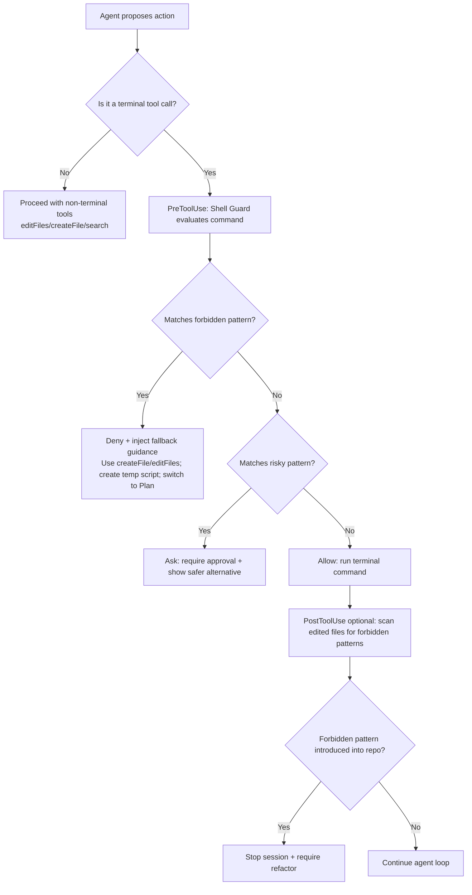

# Preventing Heredocs and Unsafe Shell Patterns in Copilot Agent Workflows for github-shell-helpers

## Executive summary

Your observed “heredoc / long inline script / redirection” failures are a predictable outcome of how agent-mode systems try to be helpful: they need a fast way to create multi-line files and run quick one-off programs, and the easiest generic pattern the model “knows” is to inline everything into a terminal command (often via heredocs), then retry when it fails. In VS Code agent sessions, this can degrade into loops because agents can (a) keep iterating until success, and (b) auto-retry under higher autonomy modes. citeturn12search0

The most reliable fix is a layered approach:

- **Behavior shaping (soft)**: repository custom instructions + a concise “anti-heredoc” Copilot prompt + (optionally) a custom agent/prompt file that nudges Copilot to prefer editor-based file edits and short, reviewable commands. citeturn0search3turn23search1turn24search0  
- **Behavior enforcement (hard)**: an **always-on “Shell Guard” agent hook** (`PreToolUse`) that deterministically denies (or forces approval for) heredocs, long inline scripts, and unsafe redirection—*even if the model tries anyway*. Hooks are explicitly designed for this: “block dangerous commands … before they execute … regardless of how the agent was prompted.” citeturn25search0turn12search0  
- **Repo hygiene**: a repo scan + CI check that prevents these patterns from being committed (and gives precise replacements). This complements hooks: hooks stop runtime command misuse; CI prevents the same anti-patterns from becoming “institutionalized” in scripts. citeturn25search0  

A key constraint: I could not access the `rockywearsahat/github-shell-helpers` repository contents from the tools available in this session (no connector index and the repo wasn’t retrievable through web sources), so the “repository scan table” section below includes an *automated scan workflow + table generator* you can run inside the repo to produce the exact findings list you requested.  

## Why Copilot keeps reaching for heredocs and where it goes wrong

Agent mode is optimized for **closing the loop**: change code, run checks, fix failures, repeat until the prompt goal is satisfied. In VS Code, the agent can autonomously run terminal commands via the built-in terminal tool, and under higher autonomy modes it can automatically approve tools and retry on errors. citeturn12search0

Heredocs and long inline scripts are attractive to the model because they are:

- **Single-shot**: “create a file + run it” without coordinating multiple tool calls.  
- **Cross-language**: the same pattern works for shell, `node`, `python`, etc., so the model uses it as a universal hammer.  
- **Log-friendly**: the agent can show “the command” it ran in one transcript line. citeturn12search0  

Where it goes wrong in practice (especially in VS Code):

- **Shell parsing mismatches**: VS Code warns that “VS Code uses bash grammar because there is no zsh or fish grammar, so some sub-commands are not detected,” and that “subverting auto approval is possible through various techniques.” This signals that complex shell constructs (including heredoc-heavy sequences) are fragile in agent tooling contexts. (This is an inference from the documented parser limitations, not a claim about a single root cause.) citeturn12search0  
- **Tooling is not a full safety net**: VS Code notes “detection of file writes is currently minimal,” meaning shell-side file creation can slip past intended guardrails, and regex-only “auto-approve” patterns are not robust against shell obfuscation. citeturn12search0  
- **Agents “waste energy” because they’re doing their job**: the loop continues until success; if a tactic fails, the agent tries variants. Under Autopilot, it can keep going without stopping for questions. citeturn12search0  

Therefore, **prompting alone is insufficient** (Copilot may “not always follow your custom instructions in exactly the same way every time”); you need deterministic enforcement at tool execution time. citeturn23search4turn25search0  

## A concise user-facing Copilot prompt to eliminate heredocs and inline scripts

### Single-paragraph prompt (copy/paste)

When you propose or run terminal commands in this repo, **do not use heredocs (`<<EOF`), long inline interpreter snippets (`node -e`, `python -c`, `bash -c` with multi-line bodies), or shell redirection that writes files (`>`, `>>`, `tee file`)**. If you need multi-line content, **create or edit real files using VS Code file-edit tools** (for example `#createFile` / `#editFiles`) and then run the file with a short, reviewable command. Keep terminal commands under ~120 characters when possible, avoid shell-specific tricks (zsh-only features, non-portable quoting), and if a command would require heredocs/redirection, **stop and ask to switch to a file-based approach**. If you detect these patterns in existing scripts, refactor them into: (1) a checked-in script file, or (2) a small temp script under a dedicated `tmp/` folder with clear naming, and update documentation accordingly. citeturn26search3turn12search0turn23search4  

### Short examples (how you want Copilot to behave)

**Example: “I need a quick Node script to transform JSON”**  
Bad: “Run `node <<'NODE' … NODE`” (heredoc)  
Good: “Create `tmp/copilot/json-transform.mjs` via `#createFile`, then run `node tmp/copilot/json-transform.mjs input.json > output.json`—but avoid `>`; instead write output in code or use `#editFiles` to create `output.json`.” citeturn26search3turn12search0  

**Example: “Generate a config file”**  
Bad: `cat > config.yml <<EOF … EOF`  
Good: `#createFile config.yml` with the full content, then (optionally) validate with a short command that does not create files. citeturn26search3turn23search1  

**Example: “Fix failing command that used heredoc”**  
Good: “Replace heredoc with: (a) a real script file committed to repo, or (b) a temp file created through editor tools; rerun using a short command; if output needs to be captured, print to stdout and let the agent summary capture it rather than redirecting.” citeturn12search0turn26search3  

## Always-on enforcement tool design

The strongest “always-on” control you can add *inside the repo* is a **VS Code Agent Hook** because it executes deterministically at lifecycle points (not probabilistically like prompt adherence), and can deny/ask/allow tool invocations before they execute. citeturn25search0

### Proposed tool

**Name**: Shell Guard (suggested identifier: `copilot-shell-guard`)  
**Form factor**: `.github/hooks/*.json` + small guard executable (Node/Python) invoked by `PreToolUse` and optionally `PostToolUse`. Hooks are explicitly designed for enforcing security policies and approval control. citeturn25search0turn25search1turn25search5  

### Design spec table

| Spec area | Proposed design |
|---|---|
| Name | `copilot-shell-guard` |
| Purpose | Deterministically **deny or gate** terminal tool invocations that contain heredocs, long inline scripts, or file-writing redirections; inject safe fallback guidance to the agent when blocked. citeturn25search0turn12search0 |
| Enable/disable toggle | `COPILOT_SHELL_GUARD=off` env var (for local dev) **or** repo config file `.github/shell-guard.policy.json` with `"enabled": false`. Default: enabled. (“Policy as configuration” is a recommended governance pattern.) citeturn21view0turn25search0 |
| Approval gating strategy | **Deny**: heredocs and `node -e` / `python -c` above threshold. **Ask**: file redirection attempts (unless explicitly allowed) or suspicious quoting/obfuscation. **Allow**: read-only commands (status, listing, tests) and short, single-purpose commands. Hooks explicitly support `allow`/`deny`/`ask` and “most restrictive wins.” citeturn25search0turn12search0 |
| Triggers | `PreToolUse` for `runTerminalCommand` tool invocations. Optionally `PostToolUse` for `editFiles/createFile` to scan newly edited files for forbidden patterns and stop the session if introduced. citeturn25search0turn26search3 |
| Allowed command patterns (default) | `^git (status|diff|log|show|rev-parse|ls-files)\b`, `^npm test\b`, `^pnpm test\b`, `^node\s+\S+\.mjs\b` (running a file), `^python\s+\S+\.py\b` (running a file), etc. (Exact list should live in policy JSON.) citeturn25search0turn12search0 |
| Forbidden command patterns (default) | **Heredocs**: `<<-?\s*['"]?[A-Za-z0-9_]+['"]?` (any heredoc). **Inline scripts**: `\b(node|python|ruby)\s+-(e|c)\b` when script length exceeds threshold. **File writes**: `(^|[^<])>\s*\S`, `>>\s*\S`, `\|\s*tee(\s+-a)?\s+\S`. **Clobber ops**: `\|\&`, `\&>`, `2>\s*\S` to non-null paths. citeturn25search0turn12search0 |
| Fallback behaviors when blocked | Return hook output that: (1) denies the tool invocation, (2) injects **actionable alternatives**: “Create `tmp/copilot/<task>.sh|.js` via `#createFile` and run it,” “Use `#editFiles` instead of `cat > file`,” “Switch to Plan agent and produce a file-based plan.” Hooks explicitly support “systemMessage” and additional context injection. citeturn25search0turn23search1turn26search3 |
| Logging / telemetry | Append-only JSONL log in `logs/copilot-shell-guard.jsonl` capturing timestamp, tool name, decision, matched rule ID. Avoid logging full prompts or secrets; log metadata and rule IDs (“append-only audit” and “don’t log prompts in audit trails” are recommended governance practices). citeturn21view0turn25search0 |
| Testing | Unit tests for pattern matcher (allow/deny/ask) + golden tests for hook input/output JSON. Integration test: simulate `PreToolUse` input for `runTerminalCommand` and verify deny output. Hooks are JSON-in/JSON-out, so they’re straightforward to test. citeturn25search0turn25search5 |

### Agent decision flow (Mermaid)

This flow reflects the hook model: deterministic policy enforcement at `PreToolUse`, with optional post-validation. citeturn25search0  

## Implementation guidance

### Repository file layout to add

A practical “minimum viable” layout:

- `.github/copilot-instructions.md` (workspace-wide)  
- `.github/instructions/shell-safety.instructions.md` (path-specific or global)  
- `.github/prompts/` prompt(s) for safe workflows  
- `.github/agents/` custom agent to run with restricted tools  
- `.github/hooks/shell-guard.json` (always-on hook config)  
- `scripts/copilot-hooks/shell-guard.mjs` (or `.py`) as the executable guard  
- `tools/repo-scan/` for the scanning script and tests  

This uses the customization primitives VS Code and GitHub Copilot already support: custom instructions, prompt files, custom agents, and hooks. citeturn0search3turn23search1turn24search0turn25search0turn19search9  

### Hook configuration and guard script skeleton

**Hook config** (`.github/hooks/shell-guard.json`) should register a `PreToolUse` command hook (VS Code format uses event names like `PreToolUse`). citeturn25search0  

A minimal pattern is:

- Run a guard script
- Script reads hook JSON input on stdin
- If tool is `runTerminalCommand`, check `.tool_input.command`
- Output JSON that sets `permissionDecision: deny|ask|allow` with reasons and optional additional context  

VS Code documents this input/output mechanism and the `permissionDecision` contract. citeturn25search0  

### Prefer Plan/Ask instead of autonomous terminal runs

You can encode “Plan first” in two complementary ways:

- A **prompt file** (slash command) with `agent: 'plan'` that produces an implementation plan and explicitly avoids terminal actions. VS Code prompt files support an `agent` frontmatter field and can restrict tools. citeturn23search1turn26search9  
- A **custom agent** (stored in `.github/agents/*.agent.md`) whose `tools` list omits terminal execution and includes only read/search/edit primitives. Custom agents are explicitly meant for “persistent persona with specific tool restrictions.” citeturn24search0turn23search1turn12search0  

### Create temp script files via editor edits rather than heredocs

VS Code’s built-in tools include explicit file creation and edit tools (for example `#createFile` and `#editFiles`). citeturn26search3turn26search1  

In practice, your policy should push the agent to:

- Create a temp file such as `tmp/copilot/<purpose>.sh` or `tmp/copilot/<purpose>.mjs`
- Put the multi-line script content there (via `#createFile` / `#editFiles`)
- Run it using a short command like `bash tmp/copilot/<purpose>.sh` or `node tmp/copilot/<purpose>.mjs`  

This avoids heredoc delimiter mismatch, quoting hazards, and tool parsing edge cases, while making the multi-line logic reviewable in source control or at least as a real file. citeturn12search0turn26search3  

### Optional integration path: MCP server or extension tool

If you want *even stronger* control than hooks alone, you can add a custom tool surface:

- **MCP**: VS Code supports MCP tools, configured via `mcp.json` in workspace (`.vscode/mcp.json`) or user profile, and provides an MCP developer guide and configuration reference. citeturn12search1turn12search8turn12search0  
- **Extension tool**: VS Code’s Language Model Tool API lets an extension contribute tools that an agent can call, enabling deeper integration. citeturn12search2turn12search0  

Given your goal (“prevent heredocs/redirection”), hooks are usually the **lowest-effort, highest-leverage** enforcement layer because they can intercept the built-in terminal tool directly. citeturn25search0turn12search0  

## Repository scan checklist and findings table

### What to scan for

This checklist targets the patterns that cause the failures you’re seeing and the “unsafe/fragile” constructs you explicitly want to purge:

- **Heredocs**: `<<EOF`, `<<-'EOF'`, `cat <<`, `node <<`, `python <<`  
- **Long inline scripts**: `node -e`, `python -c`, `bash -c` with multi-line strings or very long bodies  
- **Unsafe file writes**: `> file`, `>> file`, `1>`, `2>`, `&>`, `| tee file`, `tee -a file`  
- **Quoting hazards**: unescaped `$` in strings meant to be literal; nested quotes in `bash -c`; “clever” concatenation that bypasses simple regex matchers (a known risk in auto-approval systems). citeturn12search0  
- **Shell-specific assumptions**: use of zsh-only features, reliance on `sed -i` semantics without portability guard, reliance on `echo -e`, etc. (Portability issues are common where agents assume “bash on Linux.”) citeturn12search0  

### How to generate the exact repository scan table

Because repo contents were not accessible from this environment, the most actionable path is to add a scan script *to the repo* that outputs a Markdown table with exact file paths and matches.

A simple approach is to run `ripgrep` patterns and emit JSON/CSV, then render a Markdown table. This integrates nicely with CI and can also be used as a `PostToolUse` hook validator. Hooks are explicitly positioned for running validation after tool use. citeturn25search0turn25search5  

### Repository scan table

**Status**: *Not populated in this report because `github-shell-helpers` contents were not retrievable in this session.*  
Below is the exact table format your scan script should emit once run inside the repo.

| Finding | File path | Line / regex match | Severity | Why it matters | Recommended fix | Replacement snippet |
|---|---|---|---|---|---|---|
| (example) Heredoc used to run Node | `path/to/file.sh` | `<<'NODE'` | High | Fragile in agent terminal flow; hard to review; often fails due to quoting/delimiter issues | Create a real `.mjs` file and run `node <file>` | Create `tmp/copilot/task.mjs` via `#createFile`; run `node tmp/copilot/task.mjs` |
| (example) File creation via redirection | `path/to/script.sh` | `cat > config.yml` | Medium | Writes files via shell; bypasses editor tool audit and can be unsafe/minimally detected | Use editor file tools (`#createFile/#editFiles`) | Replace with repo file + templating or editor-created file content |
| (example) Inline Python | `path/to/script.sh` | `python -c "..."` | Medium | Hard to quote safely; brittle across shells; discourages reuse/testing | Move to `scripts/<name>.py` | Create `scripts/<name>.py` and run `python scripts/<name>.py` |

Once the scan runs, replace these example rows with real findings (one row per match cluster), and keep the snippets short and copy/pastable. citeturn26search3turn25search0  

## Tests, QA, and prioritized next steps

### Suggested automated tests

Unit tests (fast):

- Pattern classifier tests for: heredoc detection, redirection detection, inline-script length threshold behavior, allowlist behavior. Hooks have stable JSON input/output contracts which are easy to test offline. citeturn25search0turn25search5  

Integration tests (repo-level):

- Simulate `PreToolUse` hook input for a terminal command that includes `<<EOF` and assert the hook output denies.  
- Simulate a “safe command” and assert allow.  
- Simulate a “risky but sometimes legitimate” redirect and assert ask. citeturn25search0turn12search0  

CI tests:

- Run repo scan in CI; fail if new forbidden patterns appear in committed scripts/docs.  
- Optionally run ShellCheck or equivalent on shell scripts for broader hygiene (recommended if the repo contains shell). (This is general best practice; add only if it aligns with repo scope.) citeturn25search0  

### Manual QA steps

- In VS Code, open the repo, start an Agent session, and intentionally prompt the agent to “create a config file and run a script.” Confirm:  
  - It tries heredoc/redirection → Shell Guard denies and injects clear alternative steps. citeturn25search0turn12search0  
  - It then uses `#createFile/#editFiles` and runs a short command. citeturn26search3  
- Switch autonomy levels (Default approvals vs Autopilot) and confirm the guard still blocks forbidden patterns (because it acts at hook time). citeturn12search0turn25search0  

### Prioritized next steps

First, implement deterministic enforcement so the problem stops immediately:

- Add **Shell Guard hook** (`PreToolUse`) that denies heredocs and long inline scripts, and gates redirection. citeturn25search0  

Second, reduce the likelihood Copilot even attempts the bad patterns:

- Add `.github/copilot-instructions.md` “no heredoc / no redirection writes” guidance and keep it concise (VS Code recommends concise instruction files). citeturn0search3turn14search8  
- Add a **workspace prompt file** (slash command) for “safe script execution” and “refactor any heredoc into real files,” using the `agent` and `tools` metadata to constrain behavior. citeturn23search1turn26search1  

Third, lock in repo hygiene:

- Add a repo scan script + CI check that fails on new forbidden patterns and emits the Markdown findings table you requested. Hooks can also reuse this scan as `PostToolUse` validation if desired. citeturn25search0turn25search5  

Finally, improve developer ergonomics:

- Add a custom agent (`.github/agents/shell-safety.agent.md`) that defaults to read/edit tools and avoids terminal usage unless explicitly needed. Custom agents are designed for persistent “tool-restricted personas.” citeturn24search0turn12search0