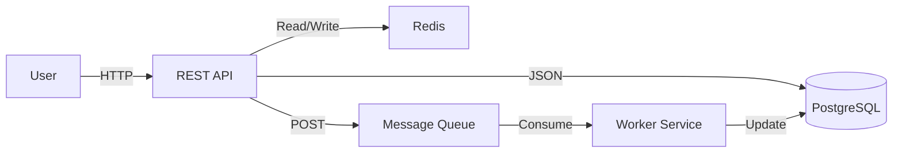

# Architecture Decision Records — ADRs, C4 Model & Diagrams-as-Code

## From Decisions to Artifacts

An architecture decision is architecture only when it's recorded. Three related disciplines work together to solve different communication problems:

- **ADRs (Architecture Decision Records)** — capture _why_ we chose one path over others, creating organizational memory
- **C4 Model** — visualize _what_ the system looks like at multiple levels of abstraction
- **Diagrams-as-Code** — keep architecture diagrams synchronized with reality by treating them as version-controlled specifications

Together, they form a system that outlasts the engineers who built it.

---

## Architecture Decision Records (ADRs)

See [process-architecture-decisions.md](process-architecture-decisions.md) for the comprehensive ADR guide (MADR format, decision log management, version control). This section adds recent context.

**Why ADRs exist:** Every architecture decision is forgotten within months. Without recorded decisions, teams:
- Re-litigate questions ("Should we use SQL or NoSQL?" gets asked every 18 months)
- Lose context when people leave (nobody remembers why the team rejected gRPC for internal services)
- Waste retros debating the past instead of building the future
- New engineers can't distinguish "we tried this and it failed" from "nobody ever tried this"

**The minimal template:**

```markdown
# [n] – [Title]

Status: Proposed | Accepted | Deprecated | Superseded by ADR-[m]
Date: YYYY-MM-DD

## Context
What constraint or question triggered this decision? Prior attempts?

## Options
Option A: [Pros] [Cons] [Effort] [Risk]
Option B: ...

## Decision
We chose **Option A** because [key reasons].

## Consequences
Positive: ...
Negative: ...
Risks to monitor: ...
```

**Key insight:** The real value is in writing the decision _while_ discussing it. The act of articulating options forces clarity. The record prevents the decision from vanishing.

**Storage:** Version-control in `docs/architecture/decisions/` alongside code. Format as Markdown, number sequentially, annotate status transitions as comments when reviewing decisions later ("Superseded by ADR-42").

---

## C4 Model: Visualizing Architecture

The C4 model (created by Simon Brown) is a hierarchical abstraction framework for drawing architecture diagrams that can be understood by stakeholders at different levels of technical depth.

The name comes from four levels of diagrams: **Context · Container · Component · Code**.

### Level 1: System Context Diagram

Shows your system as a single box and its external dependencies (users, other systems, APIs).

**Purpose:** Answer "what is this system?" for non-technical stakeholders.

**What to include:**
- Your system (single box)
- Users/actors interacting with it
- External systems it depends on (third-party APIs, databases it connects to)
- Data flows (labeled arrows)

**Example:**
```
┌────────────────────────────────────────────────────────────────┐
│  [User] ─→ [Our E-Commerce System] ─→ [Payment Gateway]       │
│             ↓                            ↑                      │
│         ┌─────────────────────────────────────┐                │
│         │  [Email Service]  [Inventory API]   │                │
│         └─────────────────────────────────────┘                │
└────────────────────────────────────────────────────────────────┘
```

### Level 2: Container Diagram

Zooms into your system and shows major internal containers (applications, microservices, databases) and their interactions.

**Purpose:** Understanding at the architectural level.

**What to include:**
- Your system's containers: web app, backend API, worker, database, cache, message queue
- External systems still visible
- Technology choices (labeled on boxes: "Node.js API", "PostgreSQL")

**Example:**
```
┌─────────────────────────────────────────────────────────────┐
│  [Web App]  [Mobile App]                   [Stripe API]     │
│      ↓         ↓                                 ↑            │
│      └─→ [REST API] ←─────────────────────────┘            │
│           ↓                                                   │
│      [PostgreSQL]  [Redis Cache]  [Message Queue]           │
│           ↑              ↑               ↓                    │
│           └──────────────┴───→ [Worker Service]             │
└─────────────────────────────────────────────────────────────┘
```

### Level 3: Component Diagram

Zooms into one container and shows its internal components (module groups, layers, major classes).

**Purpose:** For developers understanding how a service is organized.

**What to include:**
- Feature domains (e.g., "Auth", "Orders", "Payments")
- Each domain's responsibilities
- Internal communication patterns

### Level 4: Code Digram

Shows the detailed structure of a single component (classes, interfaces, dependencies).

**Purpose:** Developers implementing within the component.

**Note:** At this level, most teams use their IDE's visual tools rather than manually drawn diagrams.

### C4 Benefits

- **Scalable communication:** Different audiences get details at the right level
- **Shared vocabulary:** "Container" means a deployable unit; "Component" means a module group
- **Reduces misunderstanding:** Stakeholders see the same diagram, reducing interpretation drift
- **Forces clarity:** Drawing the diagram exposes vague thinking

### C4 Limitations

- Static snapshots (requires manual refresh when architecture changes)
- Doesn't capture runtime behavior or deployment topology
- Requires discipline to keep diagrams synchronized with code

---

## Diagrams-as-Code

The fundamental insight: **Architecture diagrams should be version-controlled, reviewable, and executable—just like code.**

Treating diagrams as code prevents the common failure mode where diagrams drift from reality because they're in slides, Confluence, or draw.io files.

### PlantUML

PlantUML allows you to write diagrams in a text-based DSL and generate PNG/SVG:

**Architecture example:**
```plantuml
@startuml system-architecture
!define AWSPUML https://raw.githubusercontent.com/awslabs/aws-icons-for-plantuml/v14.0/dist

!include AWSPUML/ApplicationIntegration/APIGateway.puml
!include AWSPUML/Database/RDS.puml
!include AWSPUML/Compute/EC2.puml

rectangle "AWS" {
    APIGateway(api, "API Gateway")
    EC2(app, "App Server")
    RDS(db, "PostgreSQL")
}

api --> app : HTTP
app --> db : SQL

@enduml
```

Then render: `plantuml -o output diagram.puml` → generates PNG/SVG.

**Advantages:**
- Git-friendly (plain text, diffable)
- Supports C4 diagrams natively
- Includes AWS, Azure, GCP icons libraries
- CI/CD integration: regenerate on every commit

**Disadvantages:**
- Steep learning curve for layout positioning
- Generated diagrams can look cluttered unless carefully tuned
- Not WYSIWYG; small text changes can cause major layout shifts

### Mermaid

Mermaid is a simpler, browser-native alternative:



This renders directly in markdown files, GitHub READMEs, and many documentation tools.

**Advantages:**
- Lower barrier to entry than PlantUML
- Works in markdown natively (GitHub, GitLab, Obsidian)
- Good for flowcharts, sequence diagrams, state machines
- Smaller, more readable output

**Disadvantages:**
- Limited architecture diagram support (no native C4)
- Less customizable than PlantUML
- Can't include AWS/cloud provider icons as easily

### Structurizr

Structurizr combines a **model-driven architecture** with code generation to multiple diagram formats:

```
// Define the model once
workspace "e-commerce" {
  model {
    customer = person "Customer"
    system "e-commerce" {
      web = container "Web App" "React"
      api = container "API" "Node.js"
      db = container "Database" "PostgreSQL"
      
      customer -> web "uses"
      web -> api "calls"
      api -> db "queries"
    }
  }
  
  views {
    systemContext "context" {
      include *
      autolayout
    }
    
    container "containers" {
      include *
      autolayout
    }
  }
}
```

Then export to PlantUML, Mermaid, or C4 JSON:

```bash
structurizr export \
  --workspace model.dsl \
  --format plantuml \
  --output output/
```

**Advantages:**
- Single source of truth: define architecture once, export to multiple formats
- Enforces consistency (all diagrams derived from same model)
- C4 model built in
- Can generate interactive web-based diagrams

**Disadvantages:**
- Learning curve (DSL + new concept)
- Proprietary tool (free tier available, but full features are paid)
- Smaller ecosystem compared to PlantUML

---

## Keeping Diagrams Fresh

The hard part isn't creating architecture diagrams—it's preventing them from becoming stale.

### Three Maintenance Patterns

**1. Regenerate from model, never from screenshots**

Store the diagram source (PlantUML, Mermaid, Structurizr DSL), not PNG/JPEG. PNG files become orphaned and drift.

```bash
# Bad: check in screenshot
git add architecture-diagram.png

# Good: check in source, regenerate
git add architecture-diagram.puml
# CI regenerates PNG on push
```

**2. Assign ownership with code reviews**

Require that architecture changes (including diagram updates) are reviewed:

```
# In .gitignore
architecture-*.png  # Regenerated by CI, don't check in

# In Makefile
.PHONY: diagrams
diagrams:
	plantuml docs/architecture/*.puml
```

In CI:
```yaml
jobs:
  verify-diagrams:
    runs-on: ubuntu-latest
    steps:
      - uses: actions/checkout@v3
      - run: apt-get install -y plantuml
      - run: make diagrams
      - run: git diff --exit-code docs/architecture/*.png
```

This forces diagram source updates when the generated output changes.

**3. Embed diagrams in runnable documentation**

Tools like:
- **mkdocs** (Python) with PlantUML rendering
- **Docusaurus** (JavaScript) with Mermaid blocks
- **Sphinx with plantuml extension** (Python)

Keep diagrams adjacent to the documentation they explain, making it obvious when to update.

---

## Integration: ADR + C4 + Diagrams

**A complete workflow:**

1. **Write an ADR** for a significant architecture change (e.g., "Split monolith into microservices")
2. **Create C4 container diagram** in Mermaid/PlantUML showing the new topology
3. **Check diagram source into git** next to the ADR
4. **Reference the diagram from the ADR** so future readers see the consequences

Example structure:
```
docs/
  architecture/
    decisions/
      0042-adopt-microservices.md      # Refs diagram below
      diagrams/
        0042-new-topology.puml         # Source of truth
        0042-new-topology.png          # Generated, .gitignored
```

In the ADR:

```markdown
# 42 – Adopt microservices architecture

...

## Consequences

See the new container topology in `diagrams/0042-new-topology.puml`:


This enables [X] but introduces operational complexity [Y].
```

---

## When to Diagram

**Diagram if:**
- New engineers onboarding can't understand the system from code alone
- You're making a deployment change (should be in ADR + diagram)
- You're explaining the system to non-technical stakeholders
- You're planning a redesign (sketch before coding)

**Don't diagram if:**
- Internal class relationships (let the IDE handle that)
- Every change (you'll go insane keeping diagrams updated)
- Trivial 3-box systems (just describe in text)

---

## See Also

- [process-architecture-decisions.md](process-architecture-decisions.md) — ADR format and governance
- [process-documentation.md](process-documentation.md) — fitting diagrams into your docs strategy
- [process-technical-writing.md](process-technical-writing.md) — writing effective architecture narratives